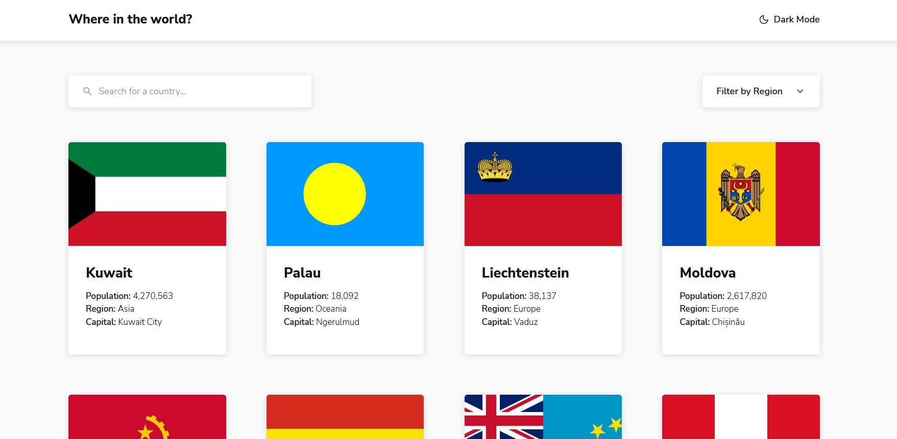

# Frontend Mentor - REST Countries API with color theme switcher solution

This is a solution to the [REST Countries API with color theme switcher challenge on Frontend Mentor](https://www.frontendmentor.io/challenges/rest-countries-api-with-color-theme-switcher-5cacc469fec04111f7b848ca). Frontend Mentor challenges help you improve your coding skills by building realistic projects.

## Table of contents

- [Overview](#overview)
  - [The challenge](#the-challenge)
  - [Screenshot](#screenshot)
  - [Links](#links)
  - [Built with](#built-with)
- [Author](#author)

## Overview

My challenge was to integrate with the [REST Countries API](https://restcountries.com) to pull country data and display it like in the designs.

### The challenge

Users should be able to:

- See all countries from the API on the homepage
- Search for a country using an `input` field
- Filter countries by region
- Click on a country to see more detailed information on a separate page
- Click through to the border countries on the detail page
- Toggle the color scheme between light and dark mode _(optional)_

### Screenshot

### Links

- Live Site URL: [See Live](https://rest-country-api-dusanlukic.netlify.app/)

### Built with

- Semantic HTML5 markup
- CSS custom properties
- Flexbox
- CSS Grid
- SCSS
- Mobile-first workflow
- JavaScript (ES6)
- GSAP

## Author

- LinkedIn - [Dusan Lukic](https://www.linkedin.com/in/dusan-lukic/)
- Frontend Mentor - [@dusanlukic404](https://www.frontendmentor.io/profile/dusanlukic404)
- Codepen - [@dusanlukic](https://codepen.io/dusanlukic)
